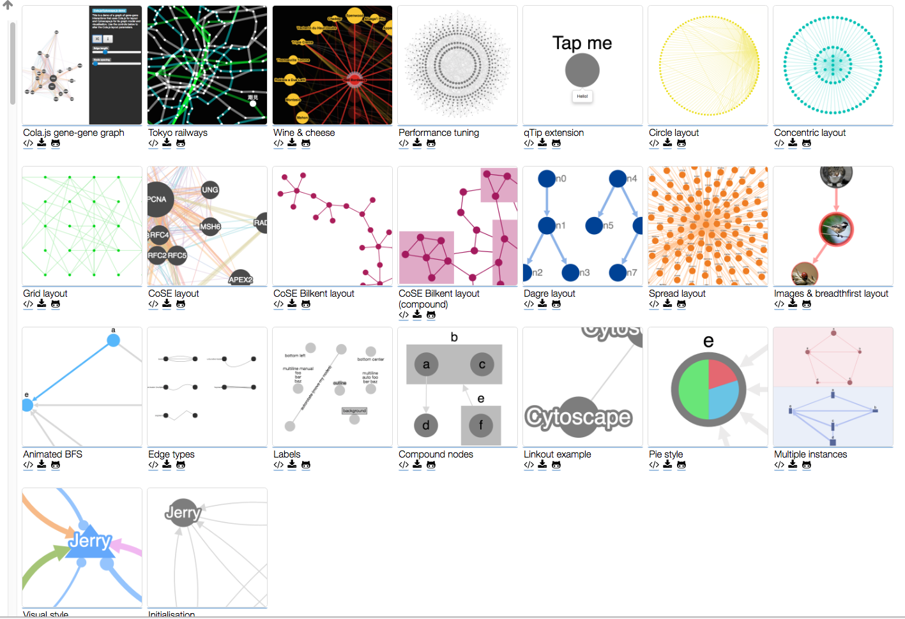

# javascript-components
 一些可能会常用到的javascript小组件，也许只是一个小的方法，收集一下，以免日后需要时再找。有些是网上收集来的创意，有些只是把其他好用的组件收集过来而已。

## object-sort.js
Javascript里自带的有array.sort方法可以对数组进行排序，但对于有些json对象，希望按照key进行排序，这个小函数就提供了这个功能。
目前只有一种默认的排序方式，如果有特殊需求，请自行扩展。

## jquery.livequery.js
默认情况下，jQuery只能判断对文档加载完成之后进行操作，但有些时候，我们可能需要针对某个特殊的Div加载完成之后再进行某些操作，那么此时这个组件就管用了，调用方式也非常简单：

```javascript

	$('#divId:visible').livequery(function() {
		//do something after div loaded
	});
```

## jquery.serialize-object.js
jQuery自带的form.serialize可以将form拼成查询字符串，或者 serializeArray方法可以将参数拼成数组，但很明显这个数组和我们正常项目里处理的数据结构是不一样的（具体哪里不一样，一试便知），这个组件生成的Json对象就是在一般提交时会使用到的方式。

```javascript

	form.serialize     		//结果应该是类似于 username=dd&age=12&date=20120122 这样的格式
	form.serializeArray   	//结果应该是类似于  [{name: ‘username', value: 'dd'}, {name: 'age', value: 12}]
	form.serializeObject 	//结果应该是： {'username': 'dd', 'age': 12, 'date': ''20120122}   (一般提交应该是需要这种格式吧)
```

## deeplyMerge.js
jQuery的$.extend方法只是合并一层的数据，对于第二层的数据，会强制覆盖，而不是我们需要的合并，如下例：

```javascript

	var objA = {name: 'Jacky', show: true, options: { ajax : true}};
	var objB = {age: 12, show: false, options: { url : 'http://www.google.com'}};

	$.extend(objA, objB);
	//上面这个合并语句，我们期待的结果其实应该是：
	{name: 'Jacky', age: 12, show: false, options: { ajax : true, url : 'http://www.google.com'}};
	//但实际上返回的是：
	{name: 'Jacky', age: 12, show: false, options: {url : 'http://www.google.com'}};
	//也就是options里面的ajax没有了，因为jQuery只合并第一层

	//这个时候如果调用以下语句，返回的就是期待的最大集合了
	objA = deeplyMerge(objA, objB);
```

## jquery.isotope.js
实现页面上根据不同条件过滤显示部分列表项，这个组件已经全部完成，只需要写html页面即可，非常方便，而且效果不错。
具体演示可以参见jquery.isotope.html。

## numeral-1.5.3.1.zip
Javascript里用来格式化字符串的，看下来功能还是比较好用的。具体的使用方式请参考：http://numeraljs.com/
  
Numbers

```
	Number	Format	String
	10000	'0,0.0000'	10,000.0000
	10000.23	'0,0'	10,000
	10000.23	'+0,0'	+10,000
	-10000	'0,0.0'	-10,000.0
	10000.1234	'0.000'	10000.123
```

Currency

```
	Number	Format	String
	1000.234	'$0,0.00'	$1,000.23
	1000.2	'0,0[.]00 $'	1,000.20 $
	1001	'$ 0,0[.]00'	$ 1,001
	-1000.234	'($0,0)'	($1,000)
```
## jquery-dateFormat
可以对日期进行格式的组件，具体请参考目录下的README文件
  
## Datejs
另外一个对日期进行扩展的库，同时支持对字符串格式的日期进行解析，得到日期对象。
  
## loading
在Loading目录下有3个页面加载时显示遮罩层的组件，使用上都非常方便。
  
## bootstrap-spinner
基于Bootstrap的数字上下按键功能，比较小巧易用。参见 [bootstrap-spinner.html](bootstrap-spinner.html)
  
## jquery-spinner
完全基于jQuery的数字组件，可以支持上下按键的数字加减。查看Sample请点 [这里](http://nakupanda.github.io/number-updown/)
  
## Bootstrap datetimepicker
基于Bootstrap的datetimepicker，可以支持日期、时间，时区的设置。具体详情，请参见 [README](bootstrap-datetimepicker/)

## HTML Color Picker
是不是有时候想要找一种Web页面用的颜色，却不知道对应的rgb值？这个网页里就提供了获取颜色的功能。请点 [这里](http://www.w3schools.com/colors/colors_picker.asp)

## jQuery-KingTable
一个基于jQuery的表格组件，参见 [jQuery-KingTable](https://github.com/RobertoPrevato/jQuery-KingTable.git)

## jquery-plugin-circliful
生成环形比例图形的基于jQuery的组件。[jquery-plugin-circliful](https://github.com/pguso/jquery-plugin-circliful.git)

## Object.observe
传说中在添加到ES7标准里的Object.observe方法被取消了，据说是因为性能问题。还好有Object-ovserve这个项目，实现了对象变更时的通知功能，性能到是没有测试过，但相信对于一般项目来讲，性能应该不会成为一个问题的。  
使用方法非常简单，只需要简单的一句调用即可：

```javascript  

	Object.observe(active, function(changes){
		.......
	});
```
详细使用方式参见 [Object-observe](https://github.com/gary-jiao/object-observe)

## Angular-databinding (for 1.x)
AngularJS的双向绑定功能非常方便易用，但一般在提到这个功能时，都会把整套Angular的功能都引入进来，而且项目也是Angular的模式，但如果对于普通项目，想使用双向绑定，但是又不愿意变成Angular项目结构时，就可以使用最小集合来实现双向绑定。  
同时，对于Angular，在页面上改变值时，后台的model会跟着改变，但如果在javascript代码里如果改变model的值，页面上是不会同时跟着变化的，此时需要调用$scope.$apply()来实现页面的同步改变。

```javascript  
	
	var demoApp = angular.module('demoApp', []);
	var model = {'firstName': 'Hello'; 'lastName':'World'};	//需要使用的模型
	demoApp.controller('DemoController', function($scope) {
	    $scope.model = model;
		
		//使用Object-observe组件
	    Object.observe(model, function(changes){
			//当在Javascript改变model值时，同步到页面
	        $scope.$apply();	
	    });
	});
	
	//假设点击按钮时修改对象的值，如果没有前面的observe语句，则这里的修改不会反映到页面上。
	function changeValue() {
		model.firstName = 'Hello99';
	}
```

```html

	<div class="modal-body" ng-app="demoApp" ng-controller="DemoController">	
		FirstName: <input type="text" ng-model="model.firstName">
		LastName: <input type="text" ng-model="model.lastName">
		<input type="button" value="ChangeValue" onclick="changeValue();">
	</div>
```

## jquery.floatWin
主要是实现了在全屏浮动的小窗口功能，通俗来讲，一般就是小广告功能。使用起来非常简单。

```
	$("body").floatWin({
	        srcId: 'testDiv',
	        speed: 20
	});
```

## StickySort Table
可以支持第一列固定的Table组件。https://github.com/terrymun/StickySort

## jQuery Pivot Table
基于jQuery的交叉表实现。https://github.com/nicolaskruchten/pivottable

## [Cytoscape](http://js.cytoscape.org/)
Cytoscape.js 是个开源 JavaScript 图形库，用户可以用 Cytoscape.js 来分析和制作可视化图形。它兼容 CommonJS/Node.js, jQuery 1.4+ 和纯 JavaScript。  


## jQuery图片翻转效果
鼠标移动到图片时，图片产生翻转的效果。效果参见： [jQueryTurnround20161010](jQueryTurnround20161010)

## 商品飞入购物车动画效果
点击添加到购物车后，商品加入购物车的动画效果。效果参见： [jQueryShoppingCart20160528](jQueryShoppingCart20160528)

## 鼠标移动图片产生特效
鼠标移动到图片后，可以产生几种不同的效果。 参见：[magic-animations](magic-animations)

## string.format.js
可以支持字符串的点位符替换。支持数字模式和名称模式：

```
String s = "Hello {name}";
s.format({"name" : "world"});

String s = "Hello {0}";
s.format("world");
```
## json.key-with-dot.js
当需要根据key动态取json里的数据时，如果是涉及到多层次的，也就是key里带有小数点的，默认是不支持获取这样的数据。使用这个方法，就可以有效的支持这种需求。
